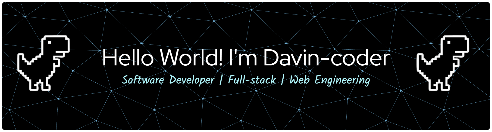

<!-- 

  

 -->

  

  🚀 Get in touch with me! 🚀

  
  

## Profile Summary

Hello, I'm a Software Developer trained at **Riwi**, focused on building **scalable, secure, and maintainable web applications**.

I work primarily in **JavaScript / TypeScript ecosystems**, developing full-stack solutions with modern frontend frameworks and backend APIs.  
Currently strengthening my knowledge in **secure Node.js practices**, **testing**, and **CI/CD pipelines**.

I value:
- Clean architecture and separation of concerns  
- Readable, well-tested code  
- Pragmatic solutions with long-term maintainability in mind  

---

## Technical Stack

### Frontend

  
  
  

I build **modern, responsive, and accessible user interfaces** using React and Next.js.

My frontend work focuses on:
- Component-driven development with clear separation of concerns  
- Server-side rendering and routing with Next.js  
- Scalable UI systems styled with Tailwind CSS  
- Performance, accessibility, and maintainability as first-class concerns

---

### Backend

  
  
  
  
  
  

I design and implement **RESTful APIs and backend services** with a strong emphasis on security and structure.

Backend experience includes:
- Building APIs with Node.js using Express and NestJS
- Applying layered architectures and clean code principles
- Developing Python-based services with FastAPI and Flask
- Handling authentication, validation, and error management consistently
- Building .NET (C#) services with Clean Architecture and DDD (Domain / Application / Infrastructure / Presentation)
- Persistence with EF Core + PostgreSQL, background jobs with Hangfire, structured logging with Serilog

---

### Databases

  
  

I work with **relational databases** to design reliable and efficient data models.

This includes:
- Schema design and normalization  
- Writing optimized queries  
- Integrating databases with backend services  
- Ensuring data integrity and consistency

---

### Testing & Quality

  
  
  
  

I prioritize **code quality and reliability** through testing and good development practices.

My approach includes:
- Writing unit and integration tests with Jest  
- Testing business logic and critical flows  
- Refactoring with confidence through test coverage  
- Maintaining readable and predictable codebases
- Unit and integration testing in .NET with xUnit, Moq and FluentAssertions

---

### DevOps & Tooling

  
  
  
  
  

I use modern tooling to support **automation, collaboration, and deployment**.

Experience includes:
- CI/CD pipelines with GitHub Actions and Azure DevOps  
- Containerization with Docker for consistent environments  
- API testing and debugging with Postman  
- Version control and team workflows with Git  

---

## Languages

  
  
  
  
  <!-- 
  
   -->

I work mainly with **TypeScript and JavaScript** for full-stack web development, **Python** for backend services and APIs, and **C#** for enterprise .NET backends.

I value:
- Strong typing and predictability with TypeScript  
- Clean, idiomatic JavaScript  
- Readable and maintainable Python code  

---

## AI-assisted Development

  
  
  

  
  

Used as **development accelerators** for:
- Code review and refactoring
- Architectural exploration
- Documentation and testing support

### Spec Driven Development (SDD)

Instead of prompting straight into code, each ticket starts as a written spec that the agent and I agree on first:

- `spec.md` → `plan.md` → `tasks.md` per feature, versioned in the repo next to the code
- Ambiguities resolved **before** implementation (clarify pass), so decisions are locked and traceable
- Implementation is executed task by task against the plan, not improvised
- The spec becomes the review artifact: PRs are validated against it

### Agent Engineering

- **Project instructions** (`CLAUDE.md`): architecture, conventions, and hard rules the agent must respect (e.g. error-handling patterns with no `try/catch` outside defined boundaries)
- **Custom skills**: reusable, versioned commands for repetitive workflows — spec creation, planning, task breakdown, conventional commits, branch validation
- **Architecture-aware skills**: one skill per layer (entity, repository, application service, DTO + mapping, controller, domain rules), so generated code lands in the right layer with the project's own conventions instead of generic boilerplate
- **Custom SDLC workflows**: multi-step pipelines (feature delivery, bugfix correction, design pass) composed from those skills and run end to end
- **Safety rules**: destructive operations explicitly denied in the instructions (e.g. no migrations applied against any database — the agent generates the SQL script and I decide when to run it)
- **Persistent memory**: locked decisions and team preferences stored as files, so context survives across sessions
- **Guardrails over vibes**: the agent works inside the project's design patterns instead of introducing its own

---

## GitHub Activity

  
| Stats | Streak |
|:---:|:---:|
|  |  |

 

  🚀 <em>Always learning, always building</em> 🚀

